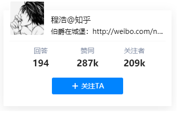

## 2022.4.24 更新: 由于知乎改了 OAuth 接口，且依赖库 zhihu-oauth 也不再更新，本项目已无法正常工作。感谢用户们这五年的信赖与支持。


## 用卡片展示你的知乎账户(<a href="https://jsfiddle.net/laike9m/y65L76cq/28/" target="_blank">Try it!</a>)

[(Eng ver.)](#english-version)




## 使用

使用个人网址的最后一部分作为 `data-userhash` 的值，如下：


```html
<div class="zhihu-card" data-userhash="cheng-hao-81"></div>
<script src="https://laike9m.github.io/zhihu-card/dist/widget.js"></script>
```

注意 `widget.js` 一定要放在 `<div>` 的后面。

其它可用的 `data-xx` 参数包括:
* `theme`: 卡片外观主题，包括 `zhihu`(default), `zhihu_new` 和 `github`
* `width`: 卡片宽度，默认值是 400
* `height`: 卡片高度
* `button`: 是否显示“关注”按钮，取值为 `yes`(default)、`no`
* `description`: 在 `github` 主题中是否显示用户个人简介，取值为 `yes`(default)、`no`
* `suffix`: 显示在用户名之后的字符串，默认为空
* `key1`, `key2`, `key3`: 卡片的三栏中显示数值的类型，取值和含义如下：

  | 取值       | 含义    |
  | -------- | ----- |
  | ask      | 提问数量  |
  | answer   | 回答数量  |
  | post     | 文章数量  |
  | agree    | 赞同数量  |
  | thanks   | 感谢数量  |
  | follower | 关注者数量 |

默认值 `key1=answer, key2=agree, key3=follower`

## 例子
```html
<div class="zhihu-card" data-userhash="cheng-hao-81"
    data-width="400" data-height="300" data-key1="answer" data-key2="agree" data-key3="post" data-theme="github" data-suffix="@知乎"></div>
<script src="https://laike9m.github.io/zhihu-card/dist/widget.js"></script>
```

# English Version

Card to show your profile on [zhihu.com](https://www.zhihu.com/).

## Usage

Use the last part of your homepage url as `data-userhash`'s value, like this:


```html
<div class="zhihu-card" data-userhash="cheng-hao-81"></div>
<script src="https://laike9m.github.io/zhihu-card/dist/widget.js"></script>
```

Make sure to place `widget.js` behind/under `<div>`.

Available data parameters are:
* `theme`: card appearance theme, options: `zhihu`(default), `zhihu_new` and `github`
* `width`: card width, default is 400
* `height`: card height
* `button`: whether to show "follow" button，options: `yes`(default), `no`
* `description`: when using `github` theme, whether to show user description, options: `yes`(default), `no`
* `suffix`: string shown after user name, default is empty
* `key1`, `key2`, `key3`: control values displayed in three columns, available values and their meaning are shown below:

  | value    | meaning             |
  | -------- | ------------------- |
  | ask      | number of questions |
  | answer   | number of answers   |
  | post     | number of posts     |
  | agree    | number of agree     |
  | thanks   | number of thanks    |
  | follower | number of followers |

default: `key1=answer, key2=agree, key3=follower`

## Example
```html
<div class="zhihu-card" data-userhash="cheng-hao-81"
    data-width="400" data-height="300" data-key1="answer" data-key2="agree" data-key3="post" data-theme="github" data-suffix="@zhihu"></div>
<script src="https://laike9m.github.io/zhihu-card/dist/widget.js"></script>
```

## 致谢
特别感谢 @lepture 和他的 [github-cards](https://github.com/lepture/github-cards) 库。zhihu-card 的前端部分完全是照着 github-cards 写的。
